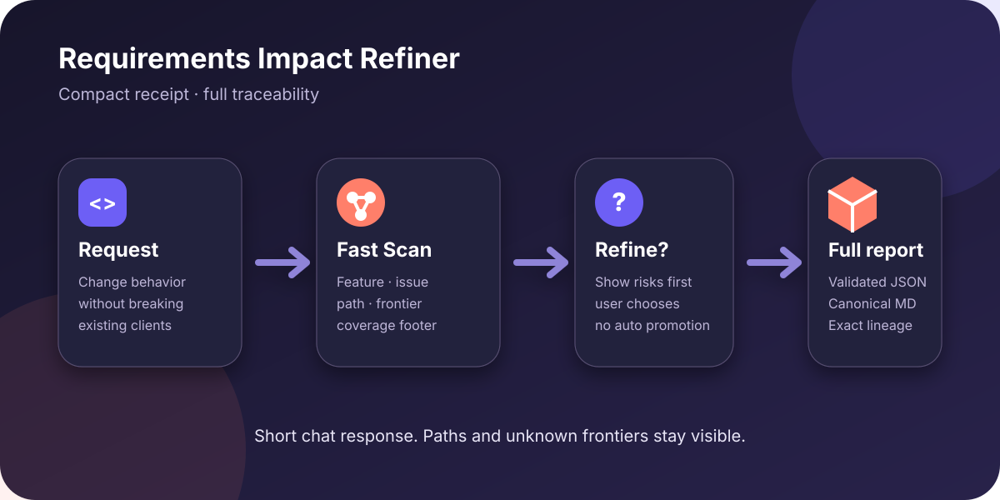

[English](README.md) | 한국어 | [日本語](README.ja.md)

# Requirements Impact Refiner

Requirements Impact Refiner `0.6.0`은 구체적인 소프트웨어 변경을 구현 계획 전에 근거와 연결된 영향도 목록으로 정제하는 **Public Preview** 저장소 인식형 Agent Skill입니다. [README.md](README.md)가 의미상 기준 문서이며 [README.ko.md](README.ko.md)와 [README.ja.md](README.ja.md)는 완전한 번역본입니다.

## 1. 문제

바이브 코딩으로 만든 변경은 최신 요구사항을 만족하면서도 잘 작동하던 권한 경계, 저장된 페이로드, 모바일 클라이언트, 보존 정책, 재시도 의미론, 관측 가능성을 조용히 망가뜨릴 수 있습니다. 일반적인 요구사항 명확화는 무엇을 만들지 설명하지만, 변경이 저장소 근거를 따라 어디까지 영향을 주는지는 반드시 추적하지 않습니다.

이 스킬은 그 빈 구간을 담당합니다. 변경 내용과 검사 범위가 구체적일 때만 시작하고, 현재 동작을 불변 조건으로 기록하며, 신뢰 수준과 함께 영향 범위를 드러냅니다. 이후 사용자가 영향을 줄이거나, 보류하거나, 해결하거나, 명시적으로 수용하도록 돕습니다. 결과는 보고서 형태의 `Planning Handoff`에서 끝나며 제품 구상, 구현 계획 작성, 코드 수정, 디버깅, 코드 리뷰는 하지 않습니다.

## 2. 핵심 개념

기준 스킬은 [`skills/requirements-impact-refiner/SKILL.md`](skills/requirements-impact-refiner/SKILL.md)입니다. 모든 수정 내역을 추적할 수 있도록 안정적인 ID를 사용합니다.

| ID | 의미 |
| --- | --- |
| `RPT-###` | 연속된 리비전에서 유지되는 보고서 식별자 |
| `REQ-###` | 최초 또는 정제된 요구사항 |
| `INV-###` | 보존이 필요할 수 있는 현재 동작 |
| `IMP-###` | 영향을 받는 동작, 계약, 데이터 경로 또는 위험 |
| `DEC-###` | 사용자나 이해관계자가 명시적으로 선택한 결정 |
| `AC-###` | 관찰 가능한 인수 또는 회귀 기준 |

근거 수준은 정확히 `verified`, `inferred`, `unknown`입니다. 영향 상태는 정확히 `detected`, `refining`, `mitigated`, `resolved`, `accepted`, `deferred`, `blocked`, `superseded`입니다. `reopened`는 종료된 영향이 다시 활성화될 때 쓰는 Delta 전이이며 원장 상태가 아닙니다. 각 보고서는 `RPT-###`, Revision, `Previous SHA-256`, 단계를 기록합니다. Revision 1 기준선은 이전 값 `none`과 모든 영향을 `new`로 사용하며, 이후 리비전은 ID를 유지하고 이전 파일의 정확한 바이트와 비교합니다.

## 3. 빠른 시작

클라이언트가 지원한다면 GitHub 저장소를 네이티브 마켓플레이스 방식으로 설치합니다. 마켓플레이스와 플러그인 이름은 모두 `requirements-impact-refiner`입니다.

Codex CLI에서는 다음을 실행합니다.

```sh
codex plugin marketplace add sdj7072/requirements-impact-refiner --ref main
codex plugin add requirements-impact-refiner@requirements-impact-refiner
```

기존 Codex 설치를 업그레이드하려면 마켓플레이스 스냅샷을 갱신하고 플러그인을 다시 설치해 캐시된 복사본을 교체합니다.

```sh
codex plugin marketplace upgrade requirements-impact-refiner
codex plugin remove requirements-impact-refiner@requirements-impact-refiner
codex plugin add requirements-impact-refiner@requirements-impact-refiner
```

저장소의 [`.agents/plugins/marketplace.json`](.agents/plugins/marketplace.json)은 루트 [Codex 플러그인 매니페스트](.codex-plugin/plugin.json)를 가리키며, 그 `skills` 필드는 하나뿐인 기준 `./skills/` 트리를 사용합니다. [`.mcp.json`](.mcp.json)은 로컬 표준 라이브러리 기반의 `rir_begin`, `rir_finalize` 도구도 노출합니다. MCP는 호스트가 도구를 호출할 때 구조화된 강제를 제공하고, 번들 CLI는 잘못된 finalize 시 사용자 출력을 내지 않는 하드 강제 경계입니다. 컨트롤러에는 네트워크 클라이언트나 서드파티 런타임 의존성이 없으며 hook, app, agent도 추가하지 않습니다.

Claude Code에서는 Claude Code 내부에서 다음 명령을 실행합니다.

```text
/plugin marketplace add sdj7072/requirements-impact-refiner
/plugin install requirements-impact-refiner@requirements-impact-refiner
```

기존 Claude Code 설치를 업그레이드하려면 마켓플레이스를 갱신하고 설치된 플러그인을 업데이트한 뒤 다시 로드합니다.

```text
/plugin marketplace update requirements-impact-refiner
/plugin update requirements-impact-refiner@requirements-impact-refiner
/reload-plugins
```

설치 요약에서 요청하면 `/reload-plugins`를 실행합니다. [`.claude-plugin/marketplace.json`](.claude-plugin/marketplace.json)은 루트 [Claude 플러그인 매니페스트](.claude-plugin/plugin.json)를 배포합니다. 로컬 개발 로딩은 저장소를 복제한 뒤 루트에서 다음을 실행합니다.

```sh
claude --plugin-dir .
```

그 밖의 [Agent Skills 호환 클라이언트](https://agentskills.io/clients)는 저장소를 복제한 뒤 기준 스킬 전체를 해당 클라이언트가 안내하는 디렉터리로 복사합니다. `.agents/skills/`는 유용한 크로스 클라이언트 기본값이지만 Agent Skills 명세가 설치 위치를 강제하지는 않습니다.

```sh
python3 scripts/install-agent-skill.py --target-dir ~/.agents/skills
```

설치기는 기존 설치를 덮어쓰지 않습니다. 클라이언트 고유 경로로 `~/.codex/skills`와 `~/.claude/skills`도 사용할 수 있지만, Codex와 Claude Code에서는 위 마켓플레이스 방식이 업데이트 관리에 더 적합합니다.

플러그인이 활성화되어 있으면 [`using-requirements-impact-refiner`](skills/using-requirements-impact-refiner/SKILL.md)가 소프트웨어 개발 대화를 자동으로 확인하고, 구체적인 동작 변경에는 계획 전의 올바른 지점에서 핵심 스킬을 호출합니다. 별도 호출 문구는 필요하지 않습니다. 자동 확인을 끄려면 클라이언트의 플러그인 설정에서 이 플러그인을 비활성화합니다.

이제 모든 보고서 앞에는 사용자 친화적인 `Change Impact Summary`가 붙습니다. 어떤 기능이 바뀌는지, 어떤 문제가 생길 수 있는지, 누구 또는 어떤 기능이 영향을 받는지, 언제 발생하는지, 어떻게 예방하거나 확인할지를 보여줍니다. 기본 대상은 `balanced`이며 저장소 루트의 `.requirements-impact-refiner.json`에서 설정할 수 있습니다.

```json
{"audience":"balanced","delivery":"compact"}
```

audience 허용값은 `simple`, `balanced`, `technical`입니다. delivery 기본값은 compact이며, 전체 기준 보고서를 인라인으로 받으려면 `delivery: full`을 요청하거나 `"delivery":"full"`을 설정합니다. Compact 모드는 append-only JSON과 Markdown을 저장하고 짧은 요약과 경로만 반환합니다. 저장할 수 없으면 이를 밝히고 `full-inline` fallback을 사용합니다. 현재 요청이 저장소 설정보다 우선합니다. 이는 Codex나 Claude 전용 설정 화면이 아닌 크로스 클라이언트 스킬 설정입니다.

기본 경로는 `rir_scan` 1회와 최대 `180 words`의 renderer-owned 응답입니다. 고위험 결과도 상세 정제를 자동 실행하지 않고 먼저 묻습니다. 그래프 엔진 목표는 `10s`, 상한은 `30s`지만 전체 모델 시간 보장은 아닙니다. 첫 대표 canary는 API → decoder → cache → migration 경로를 17 ms에 찾았지만 모델 턴은 `297.159`초였고 strict one-call automation에 실패했으므로 v0.4는 계속 `not verified`입니다.

상세 그래프 정제는 호환성을 위해 `rir_begin → rir_trace_impact → inspect compact receipt → rir_finalize → return display_text`를 유지합니다. 승격된 Fast Scan은 trace를 건너뛰고 기존 receipt를 재사용합니다. receipt는 impact별 짧은 경로와 coverage footer 하나를 추가하며 raw provider output은 노출하지 않습니다. 모든 클라이언트에서 동일한 제한 로컬 graph 설정을 사용합니다.

```json
{"impact_graph":{"enabled":true,"max_seconds":30,"target_seconds":10,"providers":["auto"],"install_policy":"never","deep":false}}
```

CLI fallback은 동일한 실행 순서를 사용합니다.

```sh
python3 "$SKILL_DIR/scripts/rir-controller.py" begin --repo-root REPO --input REQUEST.json
python3 "$SKILL_DIR/scripts/rir-controller.py" trace --repo-root REPO --draft-id DRAFT_ID --input SEEDS.json
python3 "$SKILL_DIR/scripts/rir-controller.py" finalize --repo-root REPO --draft-id DRAFT_ID --graph-receipt-id RECEIPT_ID --input ANALYSIS.json
```

목표는 `10s`, hard ceiling은 `30s`입니다. detect-only이며 no automatic install or network입니다. 선택적 로컬 provider (`builtin`, `codegraph`, `scip`, `joern`, `ast-grep`)에는 각각의 license가 적용되고 missing, unsafe, unsupported, stale, failed, timed out일 수 있습니다. builtin fallback은 precision이 제한적이고, cache hit은 일치하는 receipt만 재사용하며 partial cache는 partial로 남습니다. Deep은 bounded discovery를 넓힐 뿐 complete를 증명하지 않습니다. unknown frontiers를 계속 표시합니다. `full-inline` 및 CLI fallback도 이 한계를 보존합니다. 표의 compatibility 상태는 `not verified`/`blocked` 그대로이며 transaction correctness와 review는 닫히지 않았습니다. Task 5의 parked exclusive-quarantine race는 Task 7이 해결해야 합니다.



전체 요청·응답·산출물·전체 렌더 예시는 [compact delivery demo](docs/compact-delivery-demo.md)를 참고하세요.

로딩 후에는 변경과 저장소 범위를 함께 제시합니다. 예: “계획 전에 `displayName` API 이름 변경이 API, iOS DTO, 캐시된 프로필 경로에 미치는 영향을 정제해 줘.” 오케스트레이터가 여러 개라면 정확히 하나를 선택합니다.

## 4. 예시

요청: 공개 API 필드 `displayName`을 `name`으로 변경합니다. 저장소 근거에 따르면 `ios/UserDTO.swift`가 `displayName`을 디코딩하고, 캐시된 프로필 JSON이 이 값을 저장하며, 공개 변경 이력은 한 버전의 사용 중단 유예를 약속합니다.

| 산출물 | 예시 |
| --- | --- |
| `REQ-001` | `displayName`을 `name`으로 변경한다. |
| `INV-001` | 기존 iOS 릴리스는 `displayName`을 디코딩한다. `ios/UserDTO.swift`에서 확인한 `verified` 근거. |
| `IMP-001` | 모바일 디코딩이 실패할 수 있다. 상태 `refining`, 근거 `verified`. |
| `IMP-002` | 검사하지 않은 외부 클라이언트가 `displayName`을 사용할 수 있다. 상태 `detected`, 근거 `inferred`. |
| Decision needed | 즉시 호환성 중단, 두 필드 병행, 또는 다른 명시적인 마이그레이션 정책 중 선택한다. |
| `DEC-001` | 사용자가 공개된 한 번의 사용 중단 유예 버전 동안 두 필드를 병행하기로 선택한다. |
| `REQ-002` | `name`을 도입하고 한 버전 동안 폐기 예정인 `displayName`을 보존한 뒤 호환성 기준을 통과한 후에만 제거한다. |
| `AC-001` | 해당 버전 동안 현재 iOS 디코더와 캐시 페이로드 fixture가 계속 동작한다. |

Revision 1 기준선에서는 두 영향을 모두 `new`로 기록합니다. 다음 보고서의 재계산 Delta는 `IMP-001`을 `mitigated`에 두고, 외부 소비자 근거를 검사할 때까지 `IMP-002`를 `unchanged`에 유지하며 어떤 영향도 두 번 나열하지 않습니다. 이후 근거가 해결된 영향을 무효화하면 해당 영향은 `reopened`가 됩니다. 변경 이력의 약속은 불변 조건이지 임의로 만든 사용자 결정이 아닙니다. `DEC-001`은 명시적 선택 이후에만 생깁니다.

## 5. 연동

한 번의 실행은 하나의 정식 어댑터만 소유합니다. 각 흐름은 명확화 이후, 계획 이전에 영향도 정제를 삽입합니다.

| 모드 | 정식 순서 | 어댑터 |
| --- | --- | --- |
| `generic` | 구체적인 요구사항 + 저장소 범위 → 영향도 정제 → 사용자가 선택한 계획 방식 | [`integration-generic.md`](skills/requirements-impact-refiner/references/integration-generic.md) |
| `superpowers` | `brainstorming` 설계 승인 → 영향도 정제 → `writing-plans` | [`integration-superpowers.md`](skills/requirements-impact-refiner/references/integration-superpowers.md) |
| `claude-feature-dev` | Phase 3 명확화 → 영향도 정제 → Phase 4 아키텍처 설계 | [`integration-claude-feature-dev.md`](skills/requirements-impact-refiner/references/integration-claude-feature-dev.md) |
| `spec-kit` | `speckit.specify` 또는 `speckit.clarify` → 영향도 정제 → `speckit.plan` | [`integration-spec-kit.md`](skills/requirements-impact-refiner/references/integration-spec-kit.md) |
| BMAD | 명세 → 영향도 정제 → 아키텍처/준비도 | v1에서는 수동 지침만 제공, 정식 어댑터 없음 |
| GSD 및 기타 흐름 | 요구사항 명확화 → 영향도 정제 → 계획 | v1에서는 수동 지침만 제공, 정식 어댑터 없음 |

어댑터는 앞뒤 워크플로를 직접 실행하지 않습니다. 여러 오케스트레이터가 활성화되어 있으면 결합하지 않고 사용자에게 하나를 고르게 합니다.

## 6. 호환성

아래 주장은 보존된 평가 근거로 한정됩니다. 역사적인 Codex standalone 동작 하네스는 스킬과 참조 파일을 제공한 fresh-context 실행이며 외부 플러그인 로더나 오케스트레이터가 실제 실행되었다는 증명이 아닙니다. 반대로 봉인된 v0.3.1 Codex-with-Superpowers 배치는 정식 릴리스와 기능 payload 바이트가 일치하는 실제 설치 플러그인 캐시에서 실행되었습니다. 제품, 버전, 상태 열은 모든 번역본에서 동일하며 근거 설명만 번역했습니다.

| Environment | Version | Status | Evidence note |
| --- | --- | --- | --- |
| Codex standalone behavioral harness | `codex-cli 0.148.0-alpha.15`; `gpt-5.6-luna`; hosted runtime unavailable | `not verified` | 사례당 1회 실행한 엄격 평가에서 **7/17**로 실패했습니다. 양성 0/8, 음성 3/5, 연동 4/4입니다. |
| Codex with Superpowers | `codex-cli 0.148.0-alpha.21`; `gpt-5.6-sol`; `high`; RIR `0.3.1` | `not verified` | 봉인된 v0.3.1 배치에서는 재시도 없이 첫 시도 85건이 모두 런타임 통과(85/85)했지만 기계 점수는 84/85입니다. `POS-cache` 반복 2의 잘못된 ledger/알 수 없는 `IMP-002` 실패가 유일하므로 검증 차단 요인 1건이 남습니다. |
| Codex skill quick validator | local system snapshot | `blocked` | PyYAML이 없습니다. 정적 검사에서 이 검증기의 허용 키 목록에 Agent Skills의 `compatibility` 키도 빠져 있음을 확인했으며 실행 통과로 주장하지 않습니다. |
| Codex plugin validator | local system snapshot | `blocked` | `ModuleNotFoundError: yaml`에서 실행이 중단되었습니다. manifest 테스트를 이 검증기의 통과로 대체하지 않습니다. |
| Claude Code standalone | `2.1.228 (Claude Code)`; RIR `0.3.1` structural probe | `blocked` | 구조 프로브만 수행했으며, 인증된 Claude 동작 평가는 실행하지 않았습니다. |
| Claude Code with Superpowers | `2.1.237 (Claude Code)` subagent smoke; RIR `0.5.0` | `not verified` | claude-code 모드 13개 케이스에 대한 1회 반복 동작 스모크: 음성 5/5 기계 통과(경계 케이스인 planning이 제외 규칙을 문구 그대로 인용), 양성 0/8 — v0.5 Fast Scan 경로는 1턴 하네스가 보내지 않는 확인을 기다리므로 8건 중 7건이 scan → needs_input → 질문 → 정지를 문서 그대로 수행했고 1건은 스킬을 사용하지 않았습니다. 원본 출력과 스코어카드는 [`evals/results/claude-v0.5-smoke/`](evals/results/claude-v0.5-smoke/scorecard.md)에 있습니다. |
| Claude Code with `feature-dev` | `2.1.228 (Claude Code)`; RIR `0.3.1` structural probe | `blocked` | 구조 프로브만 수행했으며 `feature-dev` 동작 호환성은 계속 차단됩니다. |
| Claude Code with Spec Kit | `2.1.228 (Claude Code)`; RIR `0.3.1` structural probe | `blocked` | 구조 프로브만 수행했으며 Spec Kit 동작 호환성은 계속 차단됩니다. |
| Generic Agent Skills-compatible harness | client/version unavailable | `blocked` | 이름이 지정되거나 구성된 일반 하네스 실행 파일이 없습니다. |

역사적인 Codex standalone 결과 **7/17**은 지원 근거가 아닙니다. 봉인된 Codex-with-Superpowers v0.3.1 증거는 오래된 1회 실행 결과를 대체합니다. 선택된 85개 런타임 출력은 모두 통과했지만, 결정적인 기계 검사 1건이 검증을 막습니다. 최종 보고서, controller, scorecard, manifest, raw transcript, 인용문이 묶인 adjudication은 [`evals/results/installed-v0.3.1/report.md`](evals/results/installed-v0.3.1/report.md)와 [`evals/results/installed-v0.3.1/adjudication.json`](evals/results/installed-v0.3.1/adjudication.json)에 보존되어 있습니다.

### 봉인된 v0.3.1 평가 증거

아래 표는 변경 불가능한 최종 평가 증거를 기록합니다. 이 표가 출시 상태를 verified로 승격하지는 않습니다.

| Evidence key | Sealed value |
| --- | --- |
| release | 0.3.1 |
| composition | Codex with Superpowers |
| Codex client | codex-cli 0.148.0-alpha.21 |
| RIR plugin | requirements-impact-refiner@requirements-impact-refiner-v031-eval |
| model / reasoning | gpt-5.6-sol / high |
| runtime outcomes | 85/85 pass; 85 attempt 1 selections; no retries |
| mechanical score | 84/85; one failure: POS-cache repetition 2 |
| adjudication | 400/400 passed; model-scored, quote-bound to sealed outputs, no independent human sign-off |
| release status | not verified; one mechanical verification blocker |
| Claude probe | 2.1.228 (Claude Code) / RIR 0.3.1; structural-only, behavioral compatibility remains blocked |

정확한 플러그인 식별자는 `requirements-impact-refiner@requirements-impact-refiner-v031-eval`입니다. 이는 isolated local evaluation-only marketplace 별칭이며 not a public install ID or support claim입니다. 상위 marketplace 이름이 의도적으로 다르므로 wrapper 파일만 제외했고, 모든 기능 payload 구성요소의 바이트는 봉인된 [installed payload](evals/results/installed-v0.3.1/installed-payload.json) 인벤토리에서 일치합니다. v0.3.1 manifest digest는 `8e195a0cd5584dd56980917ae97ca284e8ef1653570742bdb1838079ec99d88d`이며 raw transcript 인벤토리는 바이트 보존 및 비밀정보 검사를 유지합니다. 유일한 기계 실패는 `POS-cache` 반복 2에서 잘못된 Impact Ledger 행과 알 수 없는 `IMP-002` 참조를 정확히 기록합니다. 400건의 adjudication은 모두 통과했으며 모델이 채점했고, 각 인용문이 선택된 최종 출력의 부분 문자열인지 확인했으며, 독립적인 사람의 승인 기록은 없습니다. Claude 증거는 structural-only이며 차단된 동작 호환성 상태를 바꾸지 않습니다.

## 7. 비교와 비목표

Superpowers는 아이디어 구상, 계획, 실행, 디버깅, 리뷰의 오케스트레이터로 남습니다. Claude Code `feature-dev`는 단계형 기능 개발 흐름으로, GitHub Spec Kit은 명세와 계획 흐름으로 남습니다. Requirements Impact Refiner는 이들을 대체하거나 내장하지 않습니다. 각 흐름의 명확화와 계획 사이에서 저장소 근거 기반 영향도 목록과 반복적인 영향 축소를 제공합니다.

이 프로젝트는 광범위한 아이디어 발굴, 일반 PRD 작성, 아키텍처 설계, 작업 분해, 구현, 디버깅, 코드 리뷰를 제공하지 않습니다. 좁은 범위의 로컬 MCP 서버와 CLI는 영향도 보고서 생성만 제어합니다. 내장 폴백은 경계가 있는 어휘 동시출현 스캐너이며 코드 그래프 엔진이 아닙니다. AST 파싱이나 의미론적 심볼 해석은 수행하지 않고, 어휘 기반 모듈 지정자에서 제한적인 import edge만 추론합니다. MCP 호스트는 도구 호출을 건너뛸 수 있으므로 CLI finalize 경로만 하드 강제입니다. 다른 프레임워크를 자동 설치·호출·연결하지 않으며, 관련 프로젝트를 언급한다고 해서 의존성이나 코드 재사용을 뜻하지 않습니다.

## 8. 안전과 한계

저장소 접근, 검색, 테스트는 신뢰도를 높이지만 제공된 파일만으로 동작할 수도 있고 자동 접근이 보장되지는 않습니다. `verified`는 직접 검사한 근거를 뜻하며, 런타임 근거를 실제로 검사하지 않았다면 런타임 증명을 의미하지 않습니다. `inferred`와 `unknown`은 계속 표시해야 합니다. `AC-###`는 미래 목표이지 현재 동작이 통과했다는 근거가 아닙니다.

핵심 평가는 25/25가 아니라 **24/25**입니다. 알려진 단일 확률적 실패 `POS-payments-5`는 사용자가 재시도 정책을 고르기 전에 reconcile-before-retry 방식을 요구사항에 포함했습니다. 최종 체크리스트가 이 패턴을 다루지만 허용된 수정 라운드를 모두 사용했으므로 한계를 그대로 공개합니다. 별도의 워크플로 연동 최종 구성은 **30/30**입니다. 이 점수는 기록된 Codex 평가 도구의 결과이며 테스트하지 않은 클라이언트로 일반화하면 안 됩니다.

더 넓은 출시 기록은 클라이언트 지원을 추론하지 않습니다. Codex standalone은 엄격 평가 **7/17**에 실패했습니다. 7/17과 84/85는 비교할 수 없는 수치입니다: 케이스 집합(통합 어댑터 4개 대 계보 케이스 3개), 채점 함수(서사형 모델 판정 대 결정론적 검증기), 스킬 세대(v0.1 대 v0.3.1)가 서로 다릅니다. Codex with Superpowers는 전체 5회 반복, 85개 최종 v0.3.1 배치를 완료했지만 85/85 런타임 및 400/400 adjudication 수치에도 불구하고 `POS-cache` 반복 2의 기계 실패가 출시 차단 요인이므로 계속 `not verified`입니다. 외부 공급자 어댑터는 이 프로젝트가 정의한 detect-only 계약만 받으며 해당 도구들의 현재 업스트림 출력 형식을 받지 않으므로, 공급자 이름을 나열한 것이 그대로 연동된다는 주장은 아닙니다.

스킬은 검사 범위 밖의 영향을 놓칠 수 있습니다. 해결되지 않거나 `deferred`, `blocked`, `accepted`된 위험을 계획 과정에서도 유지하고, 중요한 동작은 적절한 사람의 검토와 테스트로 검증해야 합니다.

v0.2는 과거 형식입니다. `0.3.0`으로의 마이그레이션은 수동 migration입니다. 처음 변환한 산출물을 새 `RPT-###`의 Revision 1로 취급하고 `Previous SHA-256`은 `none`, 유지한 모든 영향은 `new`로 둡니다. v0.2 이전 해시를 만들어내지 마십시오. 그 다음 리비전부터 ID를 유지하고 바로 이전 파일의 정확한 바이트를 사용합니다.

## 9. 보고서 스키마와 검증

[`템플릿 선택기`](skills/requirements-impact-refiner/assets/impact-report-template.md)에서 시작합니다. 버전 `0.3.0`은 `pre-decision`과 `post-decision` 보고서를 분리하고, 선택 전 결정 기록을 금지하며, 완전하고 서로 겹치지 않는 Impact Delta와 보고서 계보를 검증합니다.

완성된 보고서는 표준 라이브러리 기반 검증기로 확인합니다.

```sh
python3 skills/requirements-impact-refiner/scripts/validate-impact-report.py --require-summary path/to/report.md
```

이후 리비전은 정확한 이전 파일과 함께 검증하며, 두 파일을 수정하지 않고 계산된 Delta를 출력할 수도 있습니다.

```sh
python3 skills/requirements-impact-refiner/scripts/validate-impact-report.py --previous previous.md current.md
python3 skills/requirements-impact-refiner/scripts/validate-impact-report.py --previous previous.md --print-expected-delta current.md
```

검증기는 필수 섹션, 정의와 참조, 정확한 근거/상태 enum, `accepted`의 결정 연결, `resolved`의 근거, critical 영향의 `AC-###` 연결, 연속 리비전 번호, 안정적인 보고서/영향 ID, 정확한 이전 해시, `reopened`를 포함한 결정적 Delta 전이를 검사합니다. `--require-summary`를 사용하면 영향마다 요약 행이 정확히 하나인지, 심각도와 상태가 원장과 일치하는지도 검사합니다. 0.3.2 이전 보고서는 이 플래그 없이 계속 검증할 수 있습니다. 인용한 저장소 사실이 참인지는 검증하지 않으며 이전 파일을 자동으로 찾지도 않습니다. 선택적인 로컬 스킬/플러그인 플랫폼 검증기는 위에 설명한 환경 문제로 `blocked`되었으며 성공했다고 주장하지 않습니다.

## 10. 개발과 기여

런타임 테스트는 Python 3.9, 3.11, 3.13에서 실행되며 표준 라이브러리만 사용합니다. 저장소 루트에서 테스트를 실행합니다.

```sh
python3 -m unittest discover -s tests -v
python3 -m unittest tests.test_documentation -v
```

품질 도구는 Python 3.13에서 별도로 실행합니다. 로컬 가상 환경을 만들고
`requirements-quality.txt`의 정확한 pin만 설치합니다.

```sh
python3.13 -m venv .quality-venv
.quality-venv/bin/pip install -r requirements-quality.txt
.quality-venv/bin/python scripts/run-quality-gates.py
```

정확한 pin은 `bandit==1.9.4`, `coverage==7.15.4`, `mypy==1.18.2`,
`ruff==0.16.3`입니다. `mypy==1.18.2`는 Python 3.13 품질 작업에서 실행되며 Python 3.9 소스 호환성을 검사합니다. Coverage는 루트 `scripts`와 `evals/harness` 소스 트리에
적용되며 최소 80%여야 합니다. Bandit은 `-ll`로 모든 confidence level에서
medium-or-higher severity를 보고합니다.

RED/GREEN 평가 원칙, 다섯 번 반복하는 대조군, 검증 명령, 호환성 주장 규칙, 번역 정책은 [CONTRIBUTING.md](CONTRIBUTING.md)를 참고하세요. 영어 문서가 기준이지만 의미가 달라지는 README 수정은 `README.ko.md`와 `README.ja.md`도 함께 고치거나 번역 대기 상태를 명시해야 합니다. 이 프로젝트는 [MIT License](LICENSE)로 제공됩니다.
